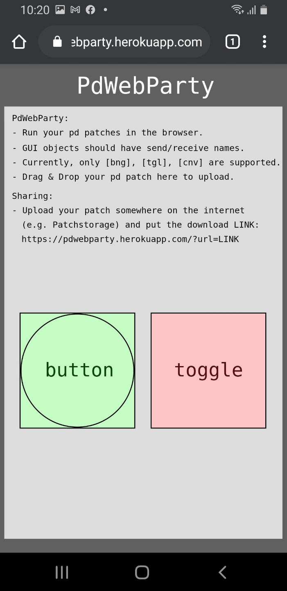

# PdWebParty


## Table of Contents
- [Description](#description)
- [Running your Pd patch](#running-your-pd-patch)
- [Sharing your Pd patch](#sharing-your-pd-patch)
- [Supported GUI objects](#supported-gui-objects)
- [Supported Pd objects](#supported-pd-objects)
- [Supported externals](#supported-externals)
- [Setup](#setup)
- [Developing PdWebParty](#developing-pdwebparty)
- [Reporting Bugs](#reporting-bugs)
- [Acknowledgements](#acknowledgements)
- [Author](#author)

## Description
**PdWebParty** is an open-source web application for running Pd patches in a web browser to allow Pd users to run their Pd patches on any device through a web browser and easily share them with others by using a web link.

Here's the [Link to the app](https://pdwebparty.herokuapp.com/).
You can also use the following QR code to go to the app link on your mobile device.


The project was inspired by Chris McCormick's [PdDroidParty](http://droidparty.net/) and Dan Wilcox's [PdParty](http://danomatika.com/code/pdparty), and it was built based on the [GSoC 2020 project for Purr Data](https://github.com/cuinjune/purr-data) to make the native Purr Data run in a web browser which is still in development. 

The goal of this project is to create a simplified version of the Purr Data web app that only supports running and sharing Pd patches through a web browser. (At least until the Purr Data web app becomes ready to be used)

## Running your Pd patch
* Create your Pd patch with the GUI objects (See [supported GUI objects](#supported-gui-objects)) placed in the main patch. (The GUI objects in subpatches will not appear in the app)
* All GUI objects should communicate with the main audio patches using send and receive only. (The GUI objects without send/receive names will not appear in the app)
* Drag and Drop your Pd patch to the app's page to upload it. (The previous patch will be replaced with the uploaded one)

## Sharing your Pd patch
* Upload your Pd patch somehwere on the internet (e.g. [Patchstorage](https://patchstorage.com/)) and copy and paste the download link into the LINK:  
  ```  
  https://pdwebparty.herokuapp.com/?url=LINK
  ```
* Example: https://pdwebparty.herokuapp.com/?url=https://patchstorage.com/wp-content/uploads/2020/12/default.pd

## Supported GUI objects
* Currently, only Bang(bng), Toggle(tgl), Canvas(cnv), and Comment are supported. (Other objects will be added soon)

## Supported Pd objects
* Almost all Pd-vanilla and extra (e.g. sigmund~) objects should work. (Haven't tested all objects yet)

## Supported externals
* arraysize 
* autotune 
* bassemu 
* boids 
* bsaylor 
* comport 
* creb 
* cxc 
* earplug 
* ekext 
* ext13 
* freeverb 
* ggee 
* hcs 
* iem_ambi 
* iem_bin_ambi 
* iemguts 
* iem_adaptfilt 
* iem_delay 
* iem_roomsim 
* iem_spec2 
* jasch_lib 
* loaders-libdir 
* mapping 
* markex 
* maxlib 
* mjlib 
* moonlib 
* motex 
* mrpeach 
* pan 
* pddp 
* rjlib 
* plugin 
* pmpd 
* sigpack 
* smlib 
* tof 
* unauthorized 
* vbap 
* windowing

## Setup
1. Installation of node.js is required. Follow [this guide](https://github.com/itp-dwd/2020-spring/blob/master/guides/installing-nodejs.md) to install it.
2. Run the following commands in the Terminal.
```
git clone https://github.com/cuinjune/PdWebParty.git
cd PdWebParty
npm install dependencies
npm start
```
3. Open your web browser and navigate to http://localhost:3000

## Developing PdWebParty
You can help develop PdWebParty on GitHub: https://github.com/cuinjune/PdWebParty<br />
Create an account, clone or fork the repo, then request a push/merge.<br />
Feel free to contact the [author](#author) if you have any questions or suggestions.

## Reporting bugs
Please post an [issue](https://github.com/cuinjune/PdWebParty/issues) if you face any problem using the app.

## Acknowledgements
* Jonathan Wilkes, Ivica Ico Bukvic, and the Purr Data team for help and feedback;
* Chris McCormick and Dan Wilcox for the inspiration for the project;
* Miller Puckette and the Pd community for developing and maintaining Pd;

## Author
Copyright (c) 2020 Zack Lee: <cuinjune@gmail.com><br />
GNU General Public License v3.0<br />
For information on usage and redistribution, and for a DISCLAIMER OF ALL WARRANTIES, see the file, "LICENSE" in this distribution.
